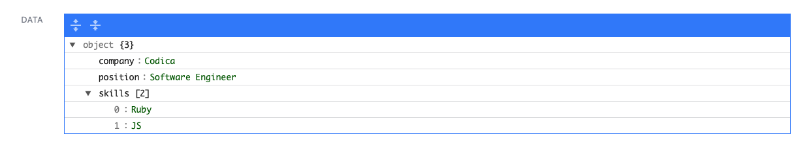

# Administrate::Field::Jsonb

A plugin to show and edit JSON objects within [Administrate](https://github.com/thoughtbot/administrate). inspired by [Administrate::Field::JSON](https://github.com/eddietejeda/administrate-field-json)

This gem uses [jsoneditor](https://github.com/josdejong/jsoneditor)

## Installation

Add this line to your application's Gemfile:

```ruby
gem 'administrate-field-jsonb'
```

And then execute:

```bash
bundle
```

## Usage

```ruby
ATTRIBUTE_TYPES = {
  # ...
  data: Field::JSONB
}.freeze
```

If you have some kind of serialization, you can call methods on your object with `transform` option.

```ruby
ATTRIBUTE_TYPES = {
  # ...
  data: Field::JSONB.with_options(
    transform: %w[to_h]
  )
}.freeze
```

## How it looks like

### Form

<p align="center">
 
</p>

### Show

<p align="center">
 
</p>

### Index

<p align="center">
 
</p>

## License

Copyright © 2015-2019 Codica. It is released under the [MIT License](https://opensource.org/licenses/MIT).

## About Codica

[](https://www.codica.com)

Timebot is maintained and funded by Codica. The names and logos for Codica are trademarks of Codica.

We love open source software! See [our other projects](https://github.com/codica2) or [hire us](https://www.codica.com/) to design, develop, and grow your product.
