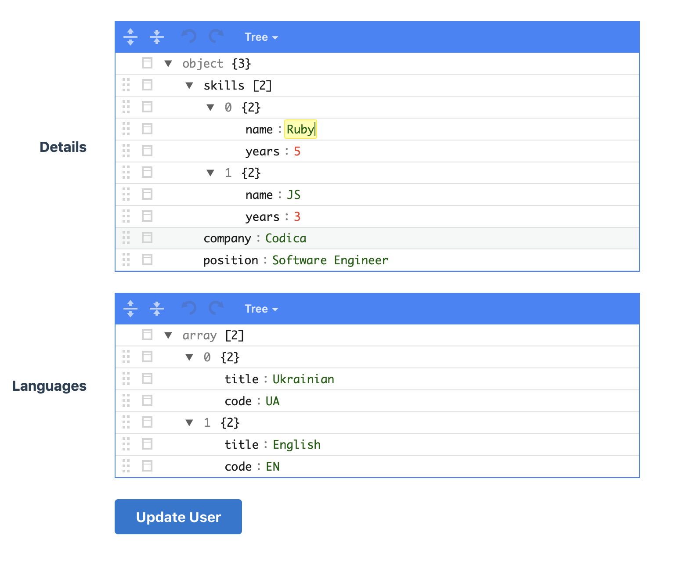
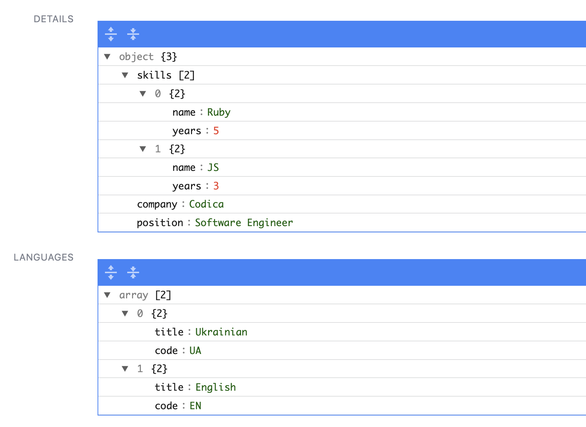
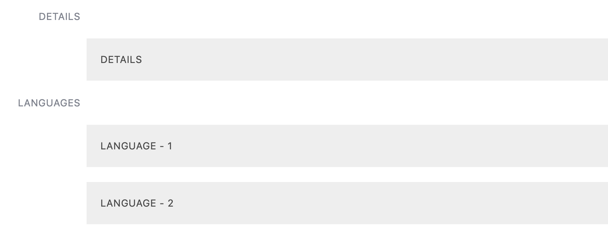
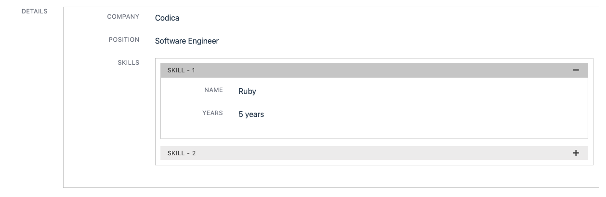
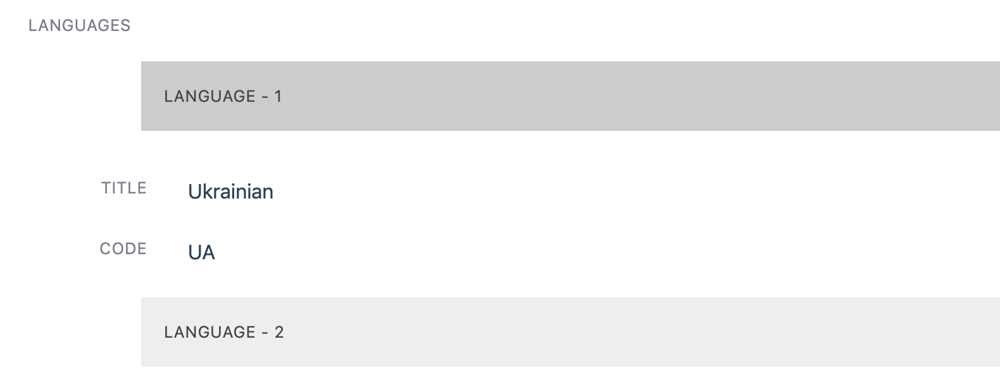

# Administrate::Field::Jsonb

A plugin to show and edit JSON objects within [Administrate](https://github.com/thoughtbot/administrate). inspired by [Administrate::Field::JSON](https://github.com/eddietejeda/administrate-field-json).

This gem uses [jsoneditor](https://github.com/josdejong/jsoneditor).

## Installation

Add this line to your application's Gemfile:

```ruby
gem 'administrate-field-jsonb'
```

And then execute:

```bash
bundle
```

If you are using asset pipeline, add the following lines to your `manifest.js`:

```js
//= link administrate-field-jsonb/application.css
//= link administrate-field-jsonb/application.js
```

The manifest file is at `app/assets/config` by default.

## Usage

```ruby
ATTRIBUTE_TYPES = {
  # ...
  details: Field::JSONB
}.freeze
```

If you have some kind of serialization, you can call methods on your object with `transform` option.

```ruby
ATTRIBUTE_TYPES = {
  # ...
  details: Field::JSONB.with_options(
    transform: %w[to_h symbolize_keys]
  )
}.freeze
```

It also supports Proc.

```ruby
ATTRIBUTE_TYPES = {
  # ...
  details: Field::JSONB.with_options(
    transform: [:transformation, Proc.new { |item| item.merge({ foo: 'bar' }) }]
  )
}.freeze
```

And there is a built in `parse_json` option, it will call `JSON.parse(your_object)` on your object.

```ruby
ATTRIBUTE_TYPES = {
  # ...
  details: Field::JSONB.with_options(
    transform: [:parse_json, :some_other_stuff]
  )
}.freeze
```

If you want to edit json displaying on `show` page, you can use `advanced_view` option (both JSON and arrays are supported).

```ruby
ATTRIBUTE_TYPES = {
  # ...
  details: Field::JSONB.with_options(transform: %i[to_h symbolize_keys], advanced_view: {
    company:  Field::String,
    position: Field::String,
    skills: Field::JSONB.with_options(advanced_view: {
      'name'  => Field::String,
      'years' => Field::Number.with_options(suffix: ' years')
    })
  }),
  languages: Field::JSONB.with_options(advanced_view: {
    'title' => Field::String,
    'code'  => Field::String,
  })
}.freeze
```

NOTE: don't define `advanced_view` option if you want to display JSON with the [jsoneditor](https://github.com/josdejong/jsoneditor).

To customize what to display if you have an empty value, use `blank_sign` option, by default it's `-`.

```ruby
ATTRIBUTE_TYPES = {
  # ...
  details: Field::JSONB.with_options(
    blank_sign: 'oops, missed'
  )
}.freeze
```

## How it looks like

### Form

<p align="center">
 
</p>

### Show

#### jsoneditor mode

<p align="center">
 
</p>

#### advanced_view mode

<p align="center">
 
</p>

#### advanced_view object

<p align="center">
 
</p>

#### advanced_view array

<p align="center">
 
</p>

## Recipes

If you want to store your JSON in hash format and not a string add this to your model.

```ruby
def your_field_name=(value)
  self[:your_field_name] = value.is_a?(String) ? JSON.parse(value) : value
end
```

Example:

```ruby
def details=(value)
  self[:details] = value.is_a?(String) ? JSON.parse(value) : value
end
```

<hr>

If you don't see details in `advanced_view`, try to add this

```ruby
transform: %i[to_h symbolize_keys]
```

or use string keys.

```ruby
languages: Field::JSONB.with_options(advanced_view: {
  'title' => Field::String,
  'code'  => Field::String,
})
```

## License

Copyright © 2015-2022 Codica. It is released under the [MIT License](https://opensource.org/licenses/MIT).

## About Codica

[](https://www.codica.com)

Administrate::Field::Jsonb is maintained by Codica. The names and logos for Codica are trademarks of Codica.

We love open source software! See [our other projects](https://github.com/codica2) or [hire us](https://www.codica.com/) to design, develop, and grow your product.
